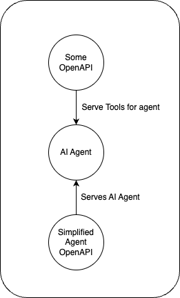
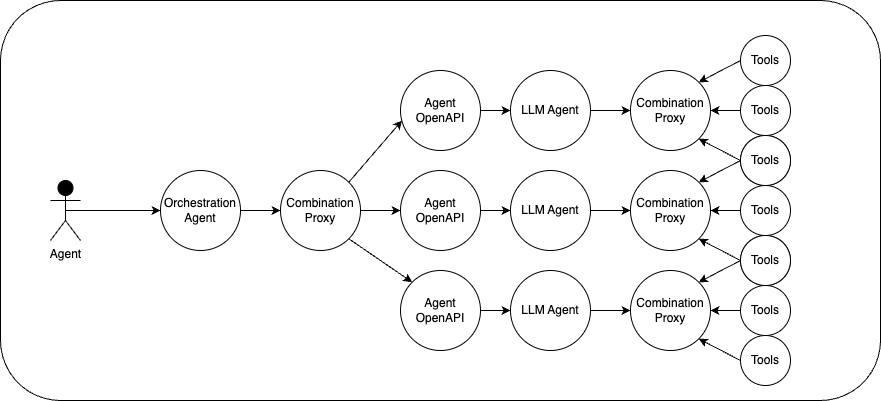
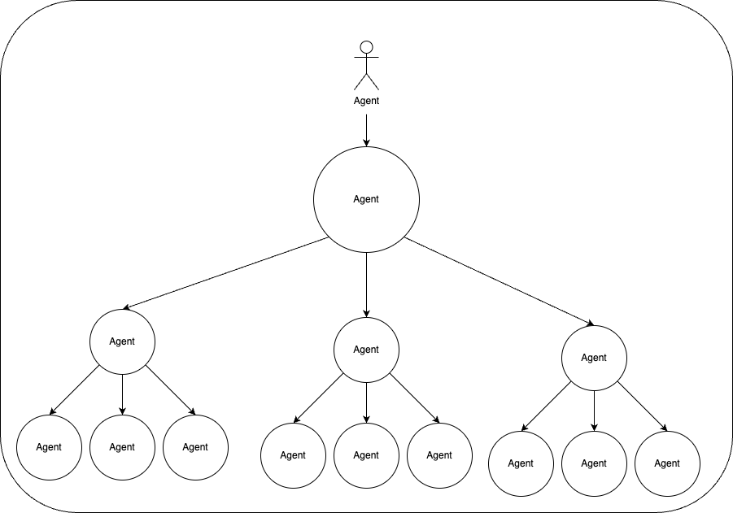

# Agent OpenAPI

Serverless Tool that serves all your Agents as OpenAPIs

## Getting started

See https://agent.actionschema.com

## Why?

LLM Assistants can be incredibly powerful as a single tool, but there's no easy way to turn an agent into a tool for another agent.

The Agent OpenAPI serves an OpenAPI for talking to an agent, so it can be discovered publicly, and can be used as a tool for other agents.

## Orchestration Agent

With the above tooling, we can now create an agent that orchestrates certain taks to downstream agents. Taking response time limitations out of the equation, this "agent stacking" pattern can be done with infinite recursion.

## Non-goals

- Testing agents

# TODO List

- ✅ Setup boilerplate
- ✅ Fix routing issues
- ✅ Implement refresh propagation to localStorage
- ✅ change pattern data.actionschema to allow for `-_~.AZ`
- ✅ make AgentOpenapi item and create crud-openapi at https://data.actionschema.com/agent-openapi/openapi.json
- ✅ create npm script that turns openapi into an SDK client
- ✅ ensure `databaseId` goes lowercase upon creation
- ✅ Fix bug so the script `npm run crud` actually works
- Implement refresh storage
- Implement simple message with `openai` sdk
- Test OpenAPI

# Future goals

After this works decently well...

- combine multiple agents using combination proxy. Orchestration agent POC.
- implement the same idea for twilio (twilio-relay + openhuman) where all phone numbers in your twilio become accessible through their own openapi.
